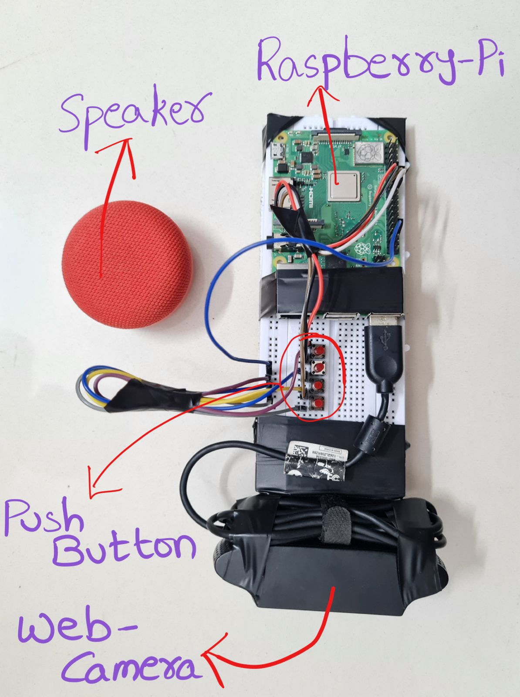

# Multilingual Image Description with Raspberry Pi

## Overview

This project captures an image using a webcam, describes the image using Azure Cognitive Services, and translates the description into multiple languages. The translated descriptions are then played as audio through a speaker. The project is implemented using a Raspberry Pi with button controls to switch between languages.

## Hardware Setup



## Features

- **Image Capture:** Captures an image using a webcam.
- **Image Description:** Describes the image using Azure Cognitive Services.
- **Multilingual Translation:** Translates the description into English, Tamil, Telugu, and Hindi.
- **Audio Playback:** Plays the description in the selected language using gTTS and Pygame.
- **Button Controls:** Uses GPIO buttons to select the language for translation and playback.

## Hardware Requirements

- Raspberry Pi
- Webcam
- Speaker
- GPIO Buttons

## Software Requirements

- Python 3
- OpenCV
- GPIO
- gTTS
- Pygame
- dotenv
- Azure Cognitive Services
- Translate

## Installation

1. **Clone the Repository:**

   ```bash
   git clone https://github.com/sponge-24/Smart-Eye
   cd Smart-Eye
   ```

2. **Install Dependencies:**

   ```bash
   pip install opencv-python RPi.GPIO gtts pygame python-dotenv azure-cognitiveservices-vision-computervision translate
   ```

3. **Setup Environment Variables:**

   Create a `.env` file in the root directory with the following content:

   ```env
   API_KEY="your api key"
   END_POINT="your end-point"
   ```

## Usage

1. **Run the Application:**

   Execute the script to start the application:

   ```bash
   python pi_imagedescription.py
   ```

2. **Button Controls:**

   - **English:** Press the button connected to GPIO pin 23.
   - **Tamil:** Press the button connected to GPIO pin 24.
   - **Telugu:** Press the button connected to GPIO pin 22.
   - **Hindi:** Press the button connected to GPIO pin 27.

## Code Structure

- `pi_imagedescription.py`: Main script that handles image capture, description, translation, and audio playback.
- `.env`: Environment variables for API key and endpoint.

## How It Works

1. **Greeting:** The application greets the user with the current date and time.
2. **Button Press:** When a button is pressed, the corresponding language function is triggered.
3. **Image Capture:** Captures an image using the webcam.
4. **Image Description:** Describes the image using Azure Cognitive Services.
5. **Translation:** Translates the description into the selected language.
6. **Audio Playback:** Plays the translated description using gTTS and Pygame.

## Troubleshooting

- Ensure you have the correct API key and endpoint in the `.env` file.
- Make sure your webcam and speaker are properly connected and configured.
- Check if required libraries are installed and updated.
